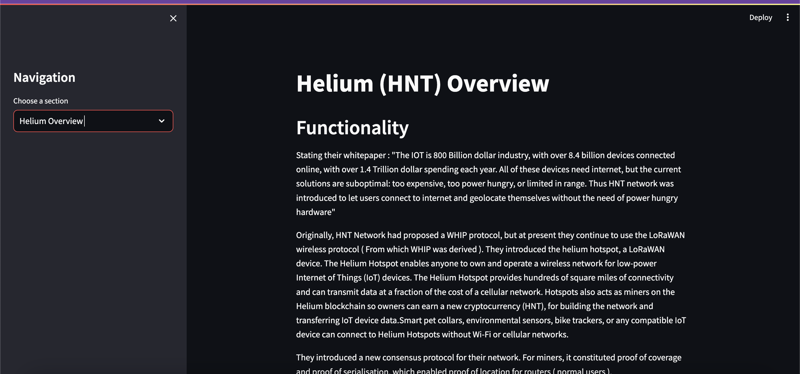
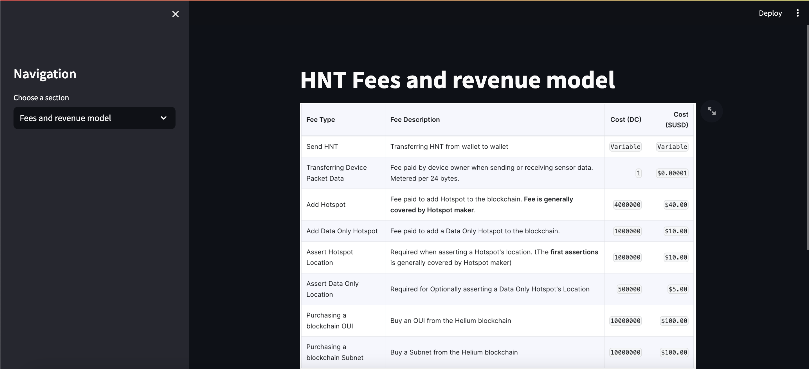
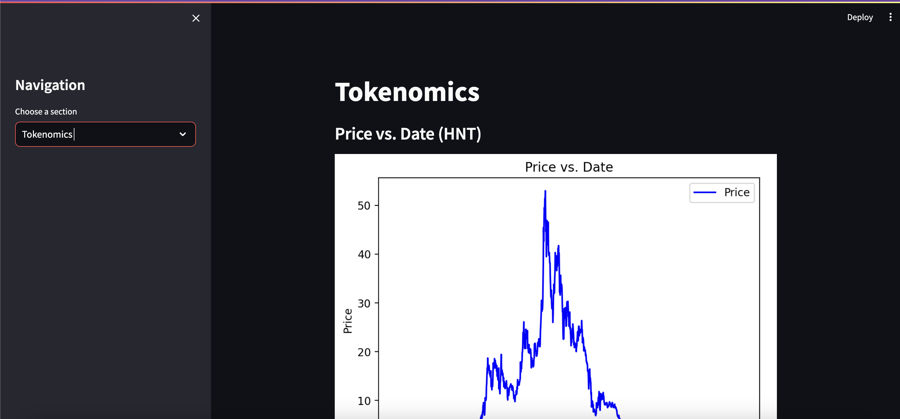
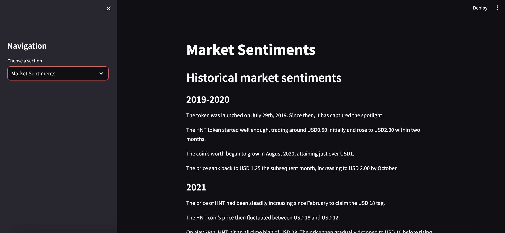
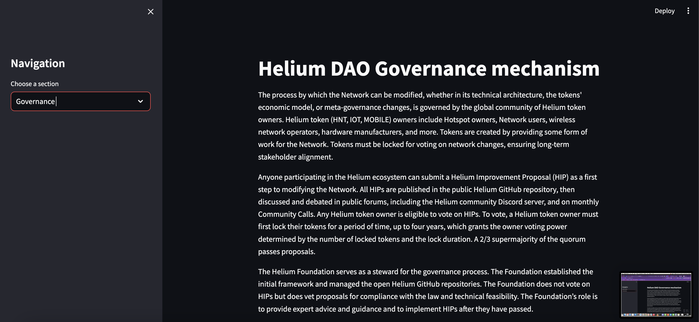
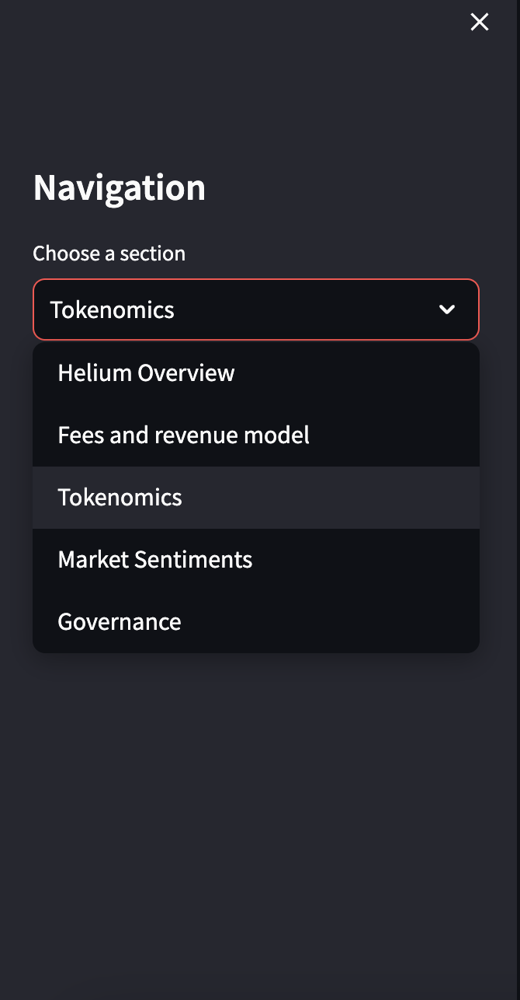

# Blaze Quant Challenge ( Helium )
This project was made for Blaze Quant challenge
Our sample token was Helium (HNT)

Our project involves 5 main sections:
1) Overview


2) Fees and revenue


3) Tokenomics


4) Sentiment analysis


5) Governance



You can toggle between all the section from navigation sidebar at left:


Run your project locally:

## Requirements
To run this project, you'll need the following:

1. **Python:**
   - Install Python from [python.org](https://www.python.org/downloads/).

2. **Streamlit:**
   - Install Streamlit using the following command:
     ```bash
     pip install streamlit
     ```

3. **Libraries:**
   - Install the required Python libraries using the following command:
     ```bash
     pip install pandas numpy matplotlib seaborn
     ```

## Getting Started
Follow the steps below to get started with the project:

1. **Clone the Repository:**
   ```bash
   git clone https://github.com/tirth2004/BlazeQuantChallenge_Helium.git
   cd BlazeQuantChallenge_Helium

2. ```bash
   streamlit run your_app.py

Contributors:
Aryan Gupta 
Tirth Bhayani

College: IIT (BHU) Varanasi


